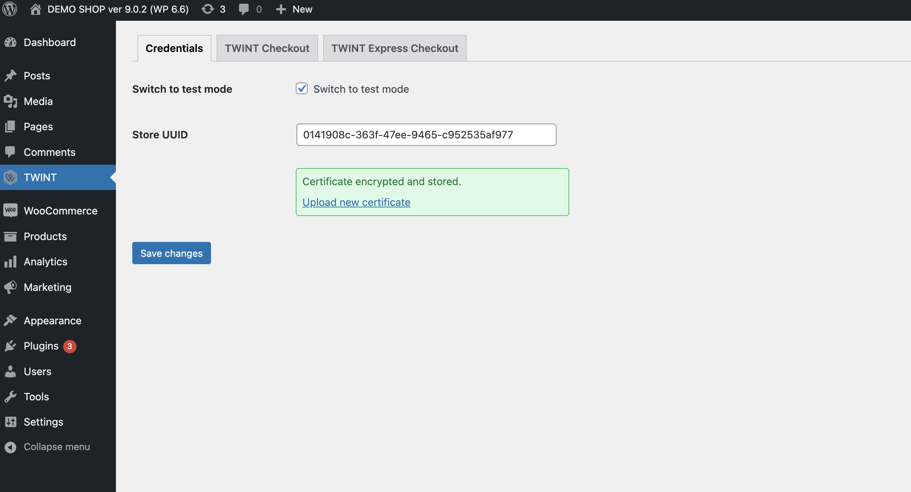
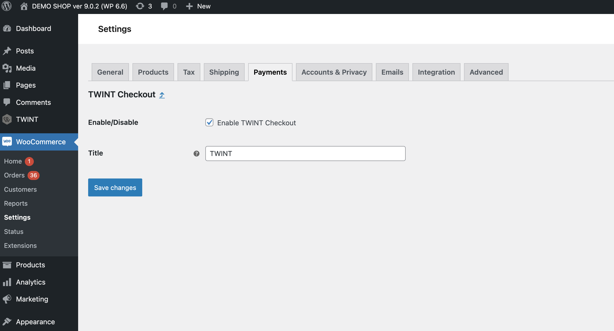
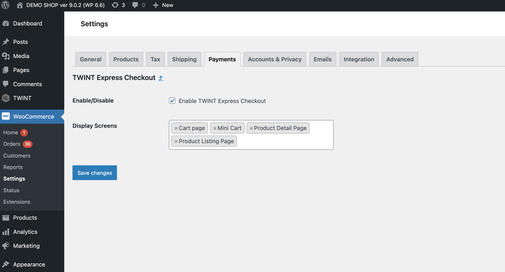

<b>TWINT Payment Plugin Guideline</b>

## Install the plugin

Please refer to the `README.md` for the installation steps.

## Configure the plugin

### Enter the Credentials

#### 1. Login to the Admin console panel

#### 2. Go to `TWINT -> Credentials`

- Enter the `Store UUID`.
- Under the `Certificate file` click `Choose file` and browse to the `*.p12` certificate file.
- Enter the `Certificate password`.
- **For test environment:** please select the `Test` option under the `Environment` dropdown.

> 🚩 **Note:** 
>
> After clicking the `Save changes` button:
> - Please wait for the message `Certificate encrypted and stored` to shows up in the `Certificate` field.
> - And the flash message `Your certificate is successfully validated` should be displayed above the header tabs.

### Configure the payment methods

#### 1. Go to `TWINT -> TWINT Checkout`

- Ensure that the `Enable TWINT Checkout` checkbox is checked.

#### 2. Go to `TWINT -> TWINT Express Checkout`

- Ensure that the `Enable TWINT Express Checkout` checkbox is checked.
- Under the `Display Screens` section -> Choose the placement for displaying the `TWINT Express Checkout` button.

