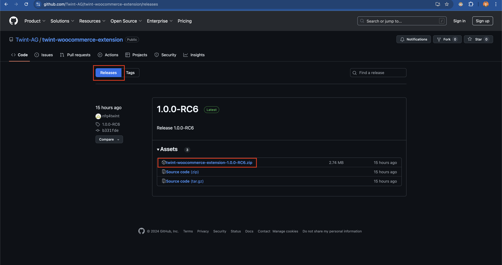
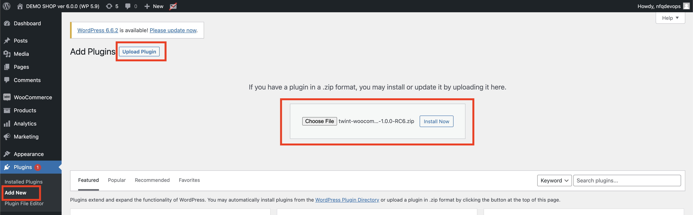
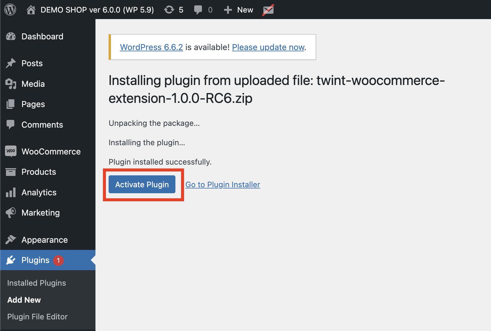
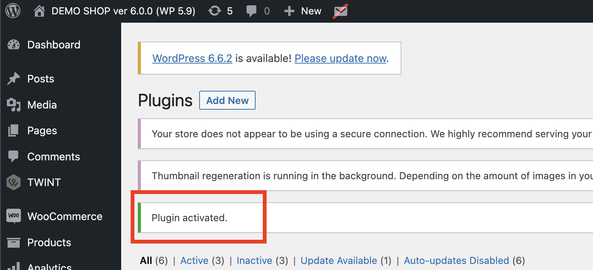
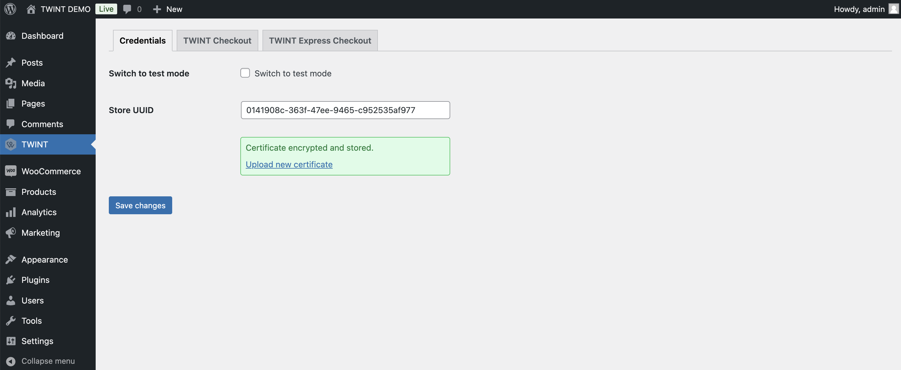
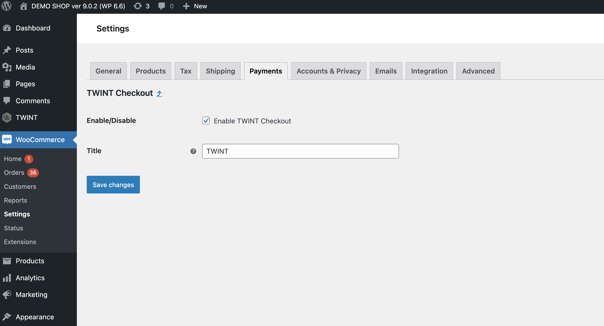
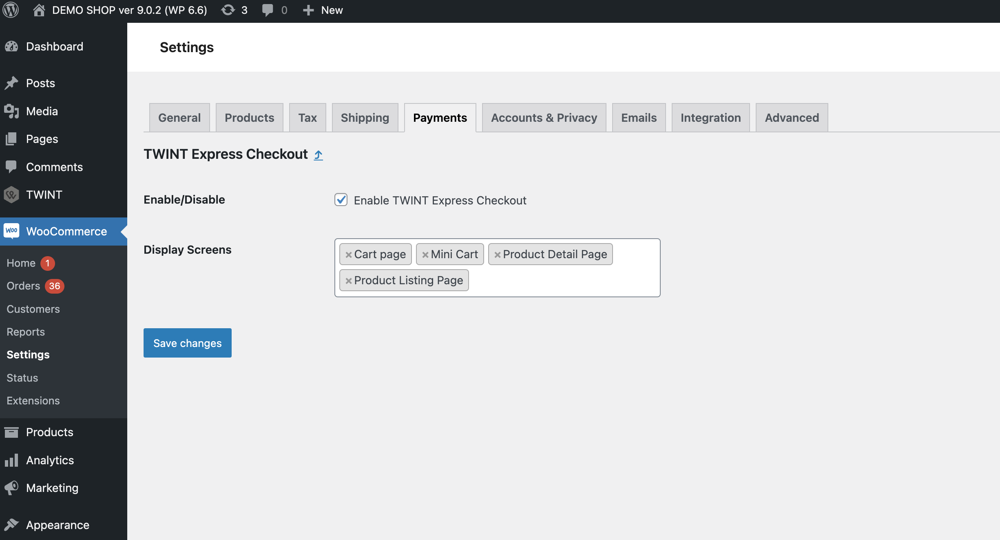

# TWINT WooCommerce Extension Guide

## Installation
### Requirement 
1. PHP 8.1 for both web service (Apache) and CLI (please refer to section below: **Note: WooCommerce PHP CLI Warning Message and Minimum Requirement**)
2. Minimum Requirement for Shop-system versions: 
 -  WooCommerce: 6.0 Wordpress: 5.9
3. Please update to the latest plugin version on Github: https://github.com/Twint-AG/twint-woocommerce-extension/releases

### Download the plugin

- Download the latest plugin `Releases` ZIP file (named `twint-woocommerce-extension-[RELEASE_VERSION].zip`) from the plugin's [Git repository.](https://github.com/Twint-AG/twint-woocommerce-extension/releases)

### Install the plugin

- Go to the WooCommerce Admin panel and login.
- Go to `Plugins -> Add New`
- Click the `Upload Plugin` button -> `Choose File` -> Browse to the downloaded plugin ZIP file

- Once the Plugin was installed -> Click the `Activate Plugin` button

- `Plugin activated.` notification should be displayed

### Check for updates of the plugin
- Go to the WooCommerce Admin Panel. 
- Go to `Plugins -> Installed Plugins`
- Click on `Check for updates`

- A message will pop up at the top of the page informing about the plugin status.

or

## Configure the plugin

### Enter the Credentials

#### 1. Login to the Admin console panel

#### 2. Go to `TWINT -> Credentials`

- Enter the `Store UUID`.
- Under the `Certificate file` click `Choose file` and browse to the `*.p12` certificate file.
- Enter the `Certificate password`.

> 🚩 **Note:**
>
> After clicking the `Save changes` button:
>
> - Please wait for the message `Certificate encrypted and stored` to show up in the `Certificate` field.
> - And the flash message `Your certificate is successfully validated` should be displayed above the header tabs.

### Configure the payment methods

#### 1. Go to `TWINT -> TWINT Checkout`

- Ensure that the `Enable TWINT Checkout` checkbox is checked.

#### 2. Go to `TWINT -> TWINT Express Checkout`

- Ensure that the `Enable TWINT Express Checkout` checkbox is checked.
- Under the `Display Screens` section -> Choose the placement for displaying the `TWINT Express Checkout` button.

## Note: WooCommerce PHP CLI Warning Message and Minimum Requirement

If you encounter the following warning message while installing the TWINT plugin, please note that this does not indicate a malfunction. However, it may have a potential impact on the user experience. The following points outline possible improvements and the **minimum requirements for PHP CLI settings**.

####  Warning Message:

> Important: PHP CLI Not Available
> 
> PHP CLI (Command Line Interface) is missing or misconfigured. This extension relies on PHP CLI for essential background processes. Without it, the plug-in is not functional. Please refer to the Guide for troubleshooting and the minimum requirements for PHP CLI settings. 
> Guide: https://github.com/Twint-AG/twint-woocommerce-extension/blob/latest/docs/twint-payment-plugin-guideline.md#note-woocommerce-php-cli-warning-message-support-message

#### Error message example: 

### Possible Causes and Solutions:

#### 1. PHP CLI Version Compatibility
- Ensure that your PHP CLI version is **8.1.0 or above**.
- Check PHP CLI version by running `php -v`

#### 2. PHP CLI Path Configuration 
- The process will invoke `php wp-content/plugins/twint-woocommerce-extension/bin/console `
- Please ensure php has read permission on `wp-content/plugins/twint-woocommerce-extension/bin/console`

### 3. Permission Setting
- Ensure the TWINT command has execution permissions. 
- Run command `php wp-content/plugins/twint-woocommerce-extension/bin/console twint:cli `
  - Expected output: _“The TWINT command was successfully executed via the PHP CLI.”_

### 4. Server or host related points
The command above will be executed using the shell_exec function (with Symfony Process). Please verify that the host allows this function to run by performing the following checks:
- `php -r "echo function_exists('shell_exec') ? 'true' : 'false';" `
  - Expected output: `true` 

or 
- run `php -r "echo ini_get('disable_functions');" `
  - Expected output: without `shell_exec` 

